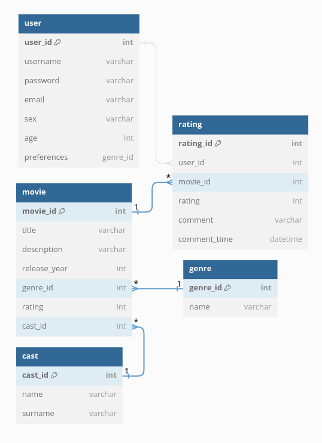

# entitete
**Film:**
- id (_primarni ključ_)
- naslov
- žanr (_tuj ključ_)
- ocena
- režiser, glavni igralci (cast) (_tuj ključ_)
- leto izida

**Uporabnik:**
- id (_primarni ključ_)
- uporabniško ime
- mail
- geslo
- starost
- spol
- všečkani filmi (_tuj ključ_)

**Ocena:**
- id (_primarni ključ_)
- id uporabnika (_tuj ključ_)
- id filma (_tuj ključ_)
- ocena
- komentar
- čas oddaje komentarja

**Žanr:**
- id (_primarni ključ_)
- naziv

**Cast:**
- id (_primarni ključ_)
- ime
- priimek

  
<h2>Opis podatkovnega modela:</h2> 
Imamo 5 entitet (user, rating, movie, genre in cast). 
Tabela _user_ vsebuje podatke o uporabnikih (enolični id uporabnika, ki je primarni ključ, uporabniško ime, geslo, email, spol, starost, ter preference).  
Tabela _rating_ vsebuje podatke o oceni filma s strani določenega uporabnika. Poleg ocene, komentarja ter časa komentarja, vsebuje še 2 tuja ključa (_user_id_ in _movie_id_). Primarni ključ je _rating_id_. 
Tabela _movie_ nosi osnovne podatke o filmu - to so naslov, opis, ocena ter čas izdaje filma. Poleg enoličnega id filma, ki je primarni ključ, tabela vsebuje še dva tuja ključa, to sta _genre_id_ (žanr filma), ter _cast_id_ (igralci). 
Tabela _genre_ opisuje žanr filma in ima primarni ključ _genre_id_. 
Tabela _cast_ nosi podatke o imenu in priimku igralca, ter ima primarni ključ _cast_id_. 
<h3>Razmerja med entitetami:</h3>

[//]: # (&#40;Tabela _rating_ je v razmerju **N:1** s tabelo _movie_ TODO: is it?)
- Tabela _rating_ je v razmerju **N:1** s tabelo _user_ (uporabnik lahko poda več ocen, posamezna ocena pa je enolična in podana s strani le enega uporabnika) 
- Tabela _movie_ je v razmerju **N:1** s tabelo _genre_ (film ima lahko več različnih žanrov)
- Tabela _movie_ je v razmerju **N:1** s tabelo _cast_  (film ima več igralcev)

